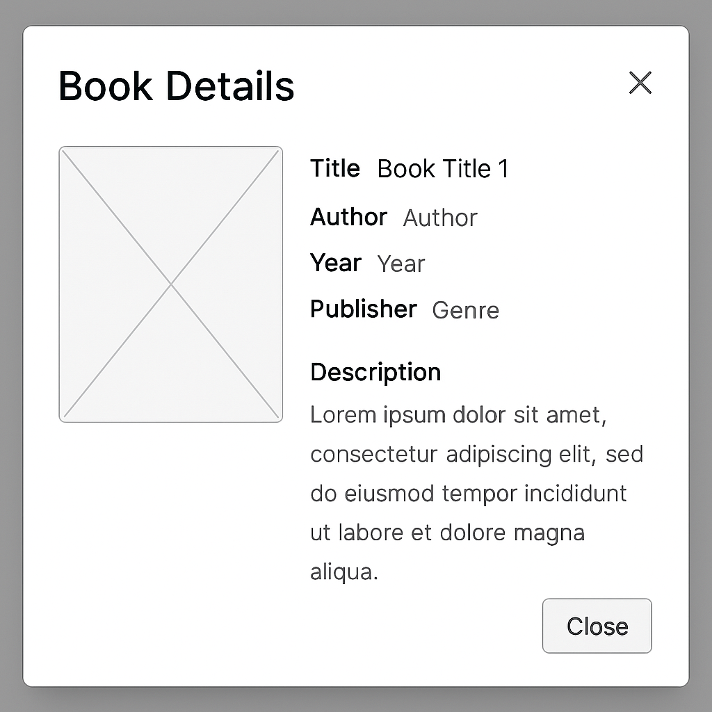

# Biblioteca
Situação de Aprendizagem - Front-End (HTML, CSS, JavaScript).
Funcionalidades (Localstorage, Modal e responsividade).

## Contextualização da Prova Prática — Sistema de Biblioteca
- Você foi contratado como desenvolvedor Front-End por uma biblioteca municipal que deseja modernizar sua gestão de livros. O objetivo é criar uma aplicação web simples e funcional que permita aos funcionários da biblioteca visualizar os livros disponíveis, acessar detalhes de cada obra e registrar a locação dos exemplares por seus leitores.

Essa aplicação será utilizada no balcão de atendimento da biblioteca, por isso precisa ser clara, objetiva e funcional, priorizando a boa usabilidade.

## Desafio
Desenvolver as funcionalidades conforme requisitos

## Configurações
- Fonte: Roboto (google fonts)
- Paletta de cores Roxo do escuro ao claro

- [ ] cor1: #5E4B8A
- [ ] cor2: #A77BCA
- [ ] cor3: #E4C1F9
- [ ] cor4: #F2E6FF
- [ ] cor5: #F9F5FF
- [ ] transp1: rgba(0, 0, 0, 0.8)
- [ ] transp2: rgba(255, 255, 255, 0.8)

### Requisitos funcionais
- [RF001] O sistema deve apresentar o portifólio de livros disponíveis na biblioteca.
    - [RF001.1] Deve possuir um botão "Ver Detalhes" para apresentar os livros (Modal).
- [RF002] Locação de livros.
    - [RF002.1] Sistema deve ter um formulário de locação.
    - [RF002.2] Dados do formulário: Nome do livro, nome do locatário, CPF, data de locação e devolução
    - [RF002.3] Deve validar se o CPF tem 11 digítos (sem pontuações).
- [RF003] Todos os dados dos livros e cadastros de locação devem ser armazenados em LocalStorage.

### Casos de teste do Front-End
 - [CT001] Validar a responsividade.
 - [CT002] Validar se os dados estão corretos no botão "Ver Detalhes".
 - [CT003] Validação se os dados estão sendo gravados em LocalStorage.

 
 ## Entrega:
 A prova deve ser entregue pelo gitpages (OBRIGATÓRIO)
 ```json
 [
  {
    "id": 1,
    "titulo": "Dom Quixote",
    "autor": "Miguel de Cervantes",
    "ano": 1605,
    "editora": "Editora Clássicos",
    "genero": "Romance",
    "descricao": "Um romance satírico sobre um fidalgo que acredita ser um cavaleiro andante."
  },
  {
    "id": 2,
    "titulo": "1984",
    "autor": "George Orwell",
    "ano": 1949,
    "editora": "Companhia das Letras",
    "genero": "Distopia",
    "descricao": "Um retrato sombrio de um futuro totalitário."
  },
  {
    "id": 3,
    "titulo": "A Revolução dos Bichos",
    "autor": "George Orwell",
    "ano": 1945,
    "editora": "Editora B",
    "genero": "Fábula política",
    "descricao": "Uma alegoria sobre o totalitarismo disfarçado de fábula animal."
  },
  {
    "id": 4,
    "titulo": "O Pequeno Príncipe",
    "autor": "Antoine de Saint-Exupéry",
    "ano": 1943,
    "editora": "Agir",
    "genero": "Infantil/Filosófico",
    "descricao": "Um conto filosófico com críticas sociais sutis."
  },
  {
    "id": 5,
    "titulo": "Orgulho e Preconceito",
    "autor": "Jane Austen",
    "ano": 1813,
    "editora": "Penguin",
    "genero": "Romance",
    "descricao": "A história de Elizabeth Bennet enquanto lida com questões de classe e amor."
  },
  {
    "id": 6,
    "titulo": "O Hobbit",
    "autor": "J.R.R. Tolkien",
    "ano": 1937,
    "editora": "HarperCollins",
    "genero": "Fantasia",
    "descricao": "A jornada de Bilbo Bolseiro em uma aventura pela Terra Média."
  },
  {
    "id": 7,
    "titulo": "Moby Dick",
    "autor": "Herman Melville",
    "ano": 1851,
    "editora": "Nova Fronteira",
    "genero": "Aventura",
    "descricao": "A obsessiva caçada do capitão Ahab pela baleia branca."
  },
  {
    "id": 8,
    "titulo": "A Metamorfose",
    "autor": "Franz Kafka",
    "ano": 1915,
    "editora": "L&PM",
    "genero": "Ficção filosófica",
    "descricao": "Um homem acorda transformado em um inseto gigante."
  },
  {
    "id": 9,
    "titulo": "Grande Sertão: Veredas",
    "autor": "João Guimarães Rosa",
    "ano": 1956,
    "editora": "Nova Aguilar",
    "genero": "Romance",
    "descricao": "Um clássico da literatura brasileira sobre o sertão e seus conflitos."
  },
  {
    "id": 10,
    "titulo": "Harry Potter e a Pedra Filosofal",
    "autor": "J.K. Rowling",
    "ano": 1997,
    "editora": "Rocco",
    "genero": "Fantasia",
    "descricao": "O começo da jornada de um jovem bruxo em Hogwarts."
  }
]
```

## Wireframes
### Catalogo de livros

1. Lista de livros:


2. Modal:


3. Cadastro:


#### Obs: Os wireframes são apenas sugestões, você pode criar o layout que desejar, desde que atenda aos requisitos funcionais e não funcionais.
Use sua criatividade e faça um layout bonito e funcional.